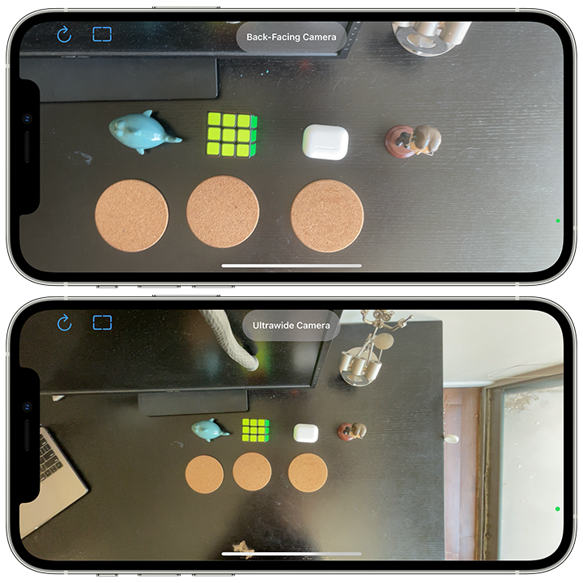

# Camera-Preview

## Description
- Created an app to share my iPhone screen as a document camera.
- Allows me to switch between my front, back, and ultrawide cameras with unobtrusive UI.
- Utilized AVFoundation to procure a preview from the device camera and display it on screen.
- Combined my UIKit camera preview with SwiftUI controls for a more efficient workflow.
- Observed NotificationCenter events to rotate the preview correctly when the device is rotate.
